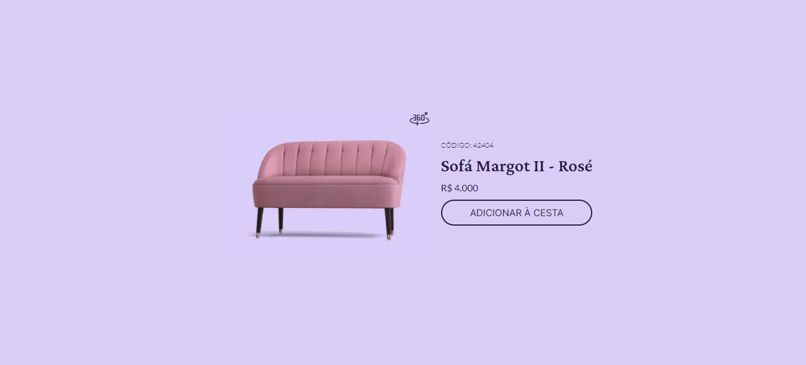

# #BoraCodar - Challenge 2 - Product Card

This is a solution to the [Product Card](https://www.rocketseat.com.br/boracodar/desafios-anteriores/um-card-de-produto-desafio-02).
## Table of contents

  - [Table of contents](#table-of-contents)
    - [The Challenge](#the-challenge)
    - [Screenshot](#screenshot)
    - [Links](#links)
    - [Built with](#built-with)
  - [Author](#author)

### The Challenge

Users should be able to:

- View the optimal layout depending on their device's screen size
- See hover states for interactive elements
- View an animated image of the product, by clicking in the 360 button

### Screenshot

### Links

- Solution URL: [Rocketseat](https://www.rocketseat.com.br/boracodar/desafios-anteriores/um-card-de-produto-desafio-02)
- Live Site URL: [Vercel](https://bora-codar-02-card-de-produto.vercel.app/)

### Built with

- Semantic HTML5 markup
- Flexbox
- [React](https://reactjs.org/) - JS library
- [Next.js](https://nextjs.org/docs) - React framework
- [Tailwindcss](https://tailwindcss.com/) - Css framework

## Author

- Linkedin - [Renato Rocha](https://www.linkedin.com/in/renato-rrodrigues/)
- Github - [@renatorrocha](https://github.com/renatorrocha)

